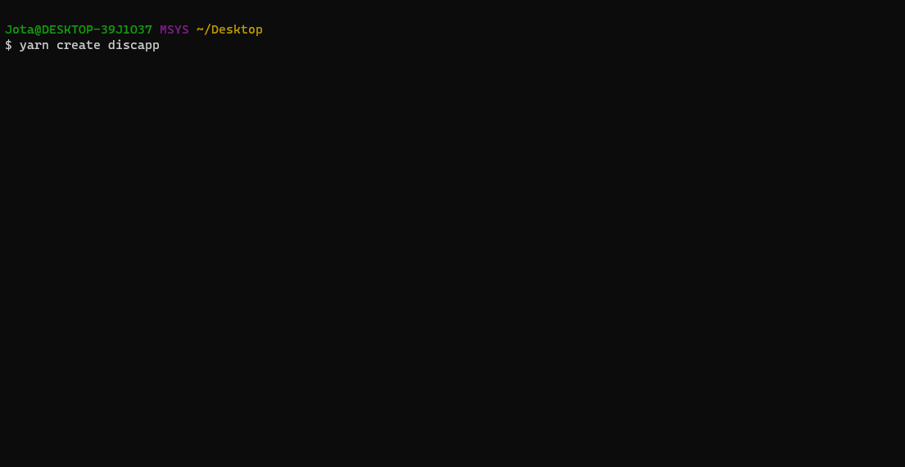

# create-discapp

<p align="center">
  
</p>

This repository contains the code for creating a Discapp project.

## Usage

```bash
yarn create discapp
```

## About

This project will clone the [Discapp demo](https://github.com/jotaajunior/discapp-demo) into your project folder, this will also execute some extra tasks:

- Install the dependencies
- Replace the name in `package.json` by your project name
- Clone `.env.example` into `.env`
